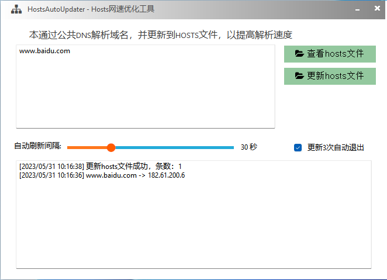
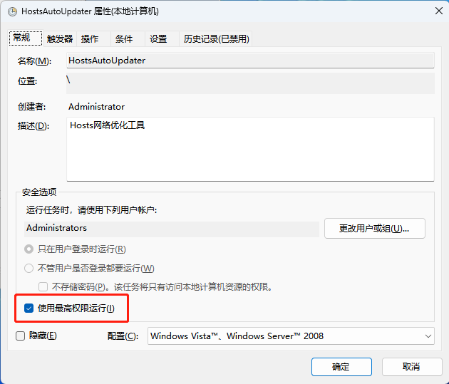

# Hosts Auto Updater 

本地hosts优化工具，包含以下功能：

1. 使用公网DNS解析指定的域名（可配置多个），将解析后的ip存储到本地的hosts文件中
2. 可设置自动更新的时间间隔
3. 可设置“更新3次后自动退出”

# 主界面

# windows计划任务设置重点

本软件使用 [aardio 编程语言 ](https://www.aardio.com) 开发
